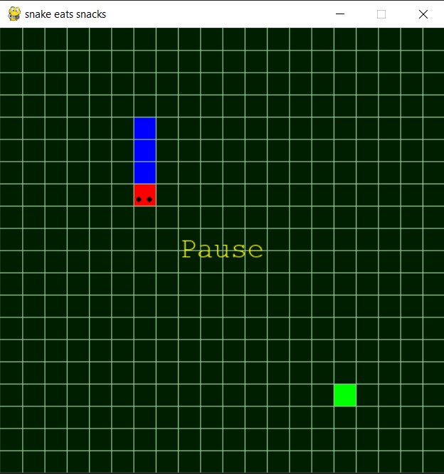
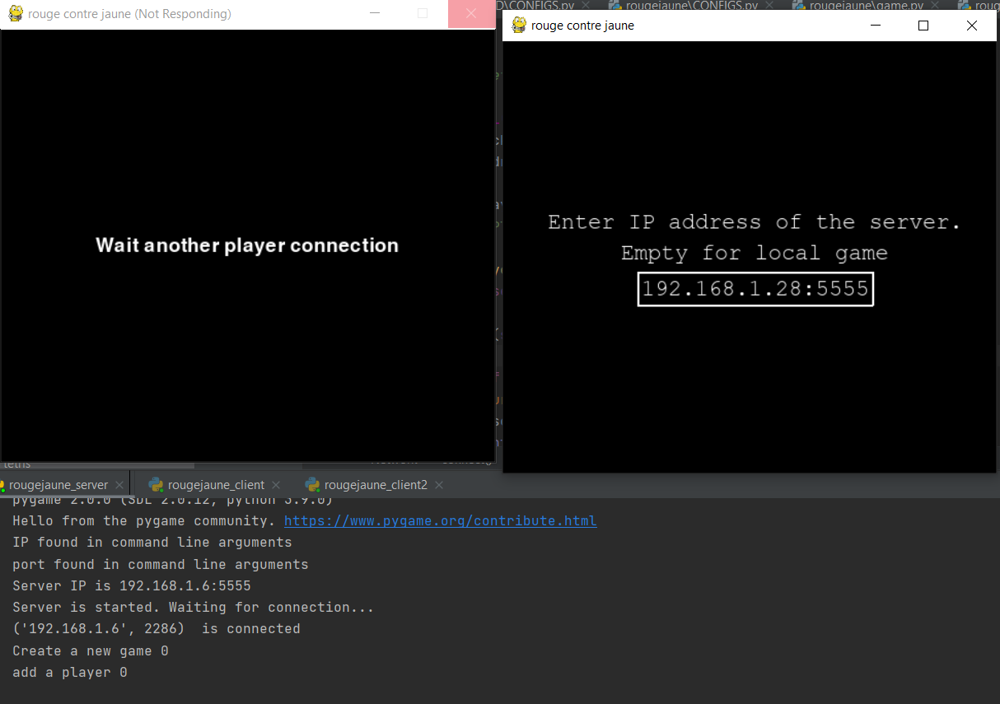
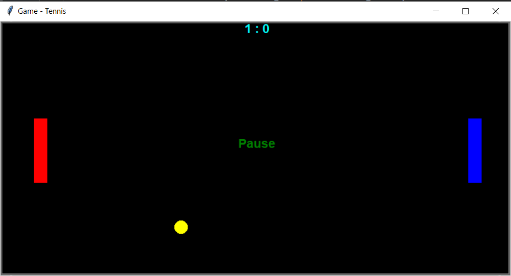
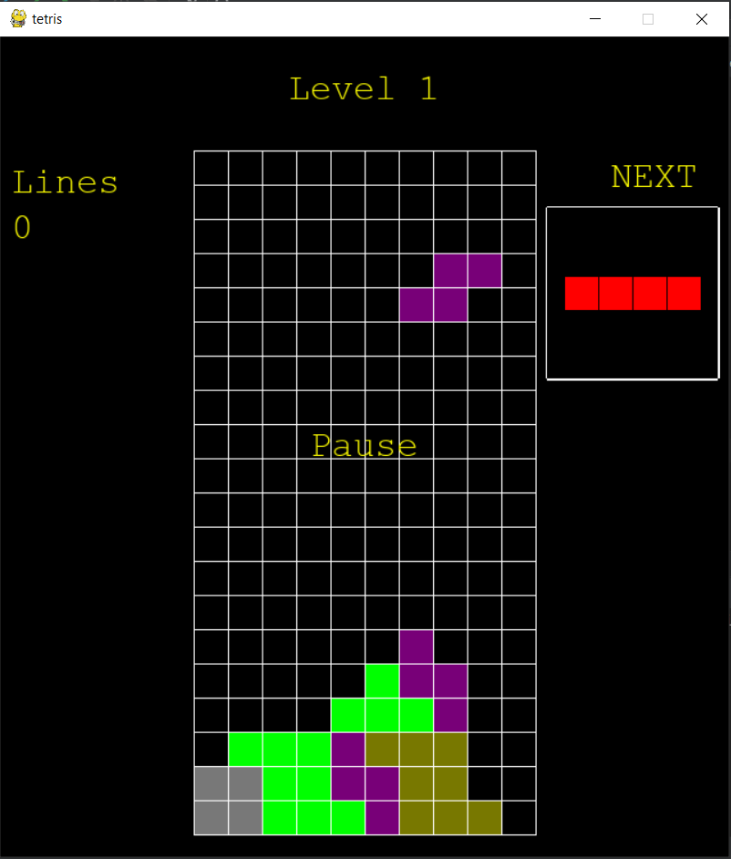
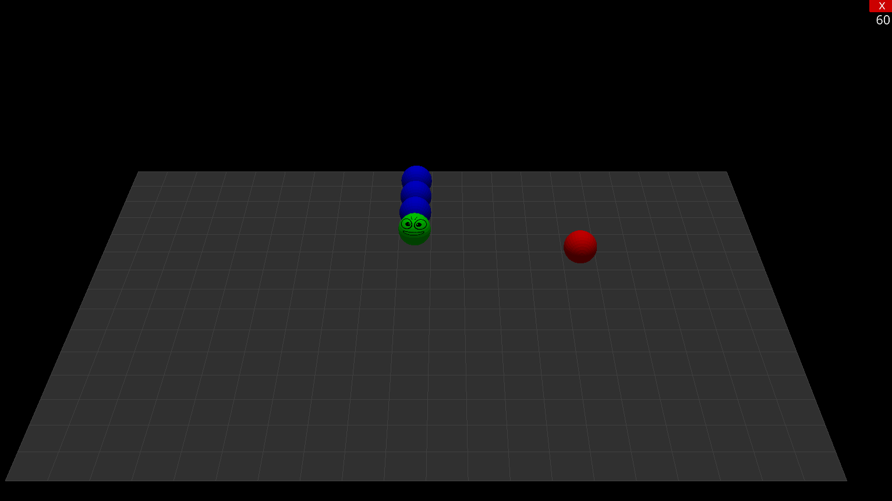

# python-games-for-kids

The set of classical games realised in PYTHON using turtle or pygame modules:
1. snake eats snacks

2. Yellow contre Red

    2a. the local version 'rougejaune.py'
    
    2b. the server version:
    
        'rougejaune_server.py' is used to start the server (check the IP address in the 'SERVER_ADDR' variable in the config file 'CONFIGS.py')
        
        'rougejaune_client.py' is used to run the game on the client computer (the IP address must be the same as on the server)

        
3. Tennis

4. Tetris

5. snake eats snacks in 3D using ursina 3D engine

# Author A.v. Korovin [a.v.korovin73@gmail.com]
